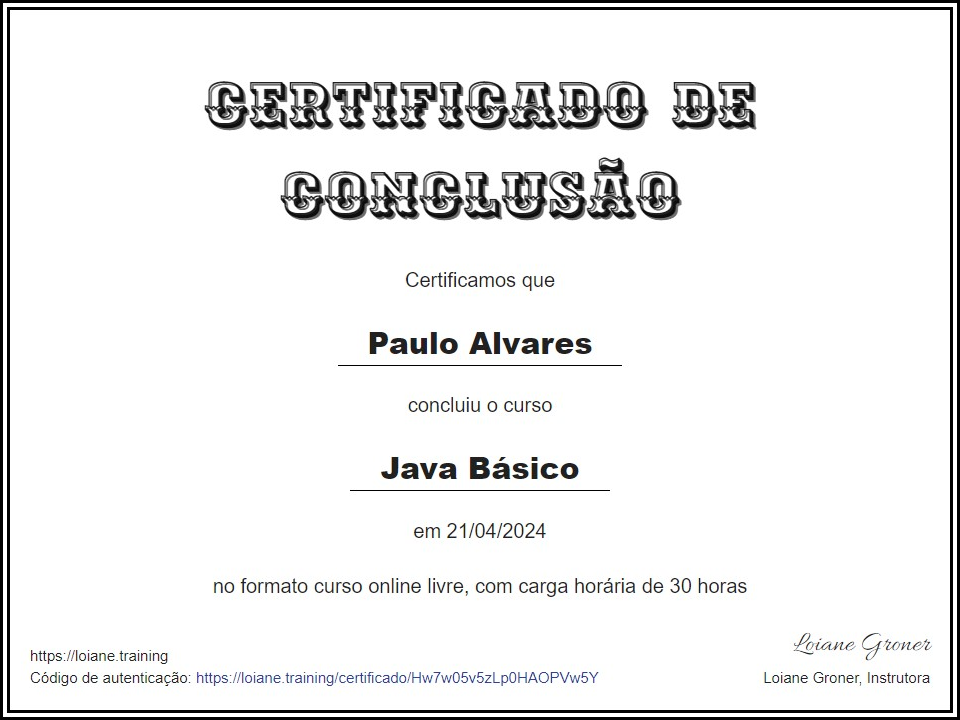

  
  <h3 align="center">Java Básico - Loiane</h3>

# 🔍Visão Geral
Este curso oferece uma introdução completa ao desenvolvimento com Java, começando pela instalação e configuração do ambiente até tópicos avançados como Programação Orientada a Objetos, herança, interfaces e tratamento de exceções. O curso também explora estruturas de controle de fluxo, manipulação de arrays, vetores e técnicas de depuração para construção de programas eficientes. Meu objetivo é dominar esses fundamentos essenciais da linguagem Java e aplicar os conceitos aprendidos para desenvolver aplicações sólidas, escaláveis e aderentes às boas práticas de desenvolvimento de software.

  <h3> 💻Tecnologias Aprendidas</h3>
  

# 📚Conteúdo Abordado
  * **Introdução e Instalação:** Apresentação dos fundamentos do Java, incluindo o processo de download, instalação e configuração do JDK. Configuração de ambiente e IDE para desenvolvimento de aplicações Java, além da execução do primeiro programa.

  * **Começando com Java:** Explicação dos primeiros conceitos da linguagem, como sintaxe básica, estrutura de um programa em Java, tipos de dados, variáveis e operações simples. Introdução ao conceito de métodos e modularização de código.

  * **Programação Básica:** Cobertura dos principais conceitos de programação, incluindo o uso de operadores aritméticos, relacionais e lógicos. Exploração de expressões, cálculos e manipulação de dados através de variáveis e constantes.

  * **Controles, Decisões e Loops:** Introdução às estruturas de controle de fluxo, como condicionais (if/else, switch) e laços de repetição (for, while, do-while). Aplicação desses conceitos para tomar decisões no código e executar blocos de forma repetida.

  * **Vetores e Matrizes:** Explicação e uso de arrays unidimensionais e bidimensionais para armazenar e manipular coleções de dados. Operações básicas com vetores e matrizes, como inicialização, iteração e busca.

  * **For each e Debug de aplicações Java:** Uso da estrutura de laço for-each para percorrer coleções de forma mais simples e eficiente. Introdução às ferramentas de depuração (debug) para identificar e corrigir erros em tempo de execução.

  * **Orientação à Objetos e Java:** Introdução aos princípios da Programação Orientada a Objetos (POO), incluindo a definição de classes, atributos e métodos. Criação e manipulação de objetos, encapsulamento e uso de construtores.

  * **Herança, Interfaces e Polimorfismo:** Exploração de conceitos avançados da POO, como herança para reutilização de código, implementação de interfaces para abstração e aplicação de polimorfismo para generalização de comportamentos.

  * **Tratamento de erros e exceções:** Implementação de mecanismos para captura e tratamento de erros em tempo de execução usando try-catch e finally. Exploração das exceções mais comuns e criação de exceções personalizadas.

# 🏅Certificado

# 🔗Recursos Adicionais
### 🔧Ferramentas
  - <a href="https://www.jetbrains.com/idea/download/">IntelliJ</a>
  - <a href="https://www.eclipse.org/downloads/packages/installer">Eclipse</a>
  - <a href="https://netbeans.apache.org/front/main/download/">NetBeans</a>
  - <a href="https://code.visualstudio.com/download">Visual Studio Code</a>

### 📦Linguagens e Pacotes
  - <a href="https://www.java.com/pt-BR/download/">Java</a>

### 📖Guias de Referência
  - <a href="https://docs.oracle.com/en/java/">Java</a>

### 📎Curso
  - <a href="https://loiane.training/curso/java-basico">Java Básico</a>
  - <a href="https://loiane.training/certificado/Hw7w05v5zLp0HAOPVw5Y">Validação do Certificado</a>

# 📬Contato

 
  
  
   
  
  
  

